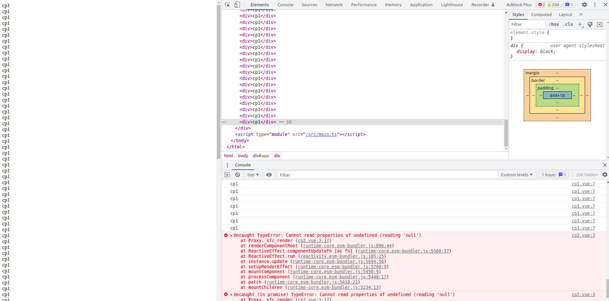

# A vue3 bug

### Vue version

3.2.37



### Link to minimal reproduction

https://github.com/ikrong/vue3-bugs

### Steps to reproduce

file components/cp1.vue

```vue
<template>
    <div>cp1</div>
</template>
<script lang="ts" setup>
import { onMounted } from 'vue'
onMounted(() => {
    console.log('cp1')
})
</script>
<style lang="less" scoped>
</style>
```

file components/cp2.vue

```vue
<template>
    <div>cp2</div>
    <div>{{data.null}}</div>
</template>
<script lang="ts" setup>
import { onMounted, ref } from 'vue'
defineProps<{
    el: any
}>()
const data = ref<any>()
onMounted(() => {
    console.log('cp2')
})
</script>
<style lang="less" scoped>
</style>
```

file App.vue

```vue
<template>
  <cp1-vue ref="cp1"></cp1-vue>
  <cp2-vue :el="cp1"></cp2-vue>
</template>
<script lang="ts" setup>
import { ref } from 'vue'
import cp1Vue from './components/cp1.vue';
import cp2Vue from './components/cp2.vue';
const cp1  = ref<typeof cp1Vue>()
</script>
<style lang="less" scoped>
</style>
```

when run vite

cp2 should cause an error

### What is expected?

render

```html
<div>cp1</div>
```

console

```
cp1
Uncaught TypeError: Cannot read properties of undefined (reading 'null')
```

### What is actually happening?

render

```html
<div>cp1</div>
<div>cp1</div>
<div>cp1</div>
<div>cp1</div>
...
```

console

```
cp1
cp1
cp1
cp1
cp1
...
Uncaught TypeError: Cannot read properties of undefined (reading 'null')
```

### System Info

```shell
System:
    OS: Linux 5.13 Ubuntu 20.04.1 LTS (Focal Fossa)
    CPU: (8) x64 Intel(R) Core(TM) i5-10210U CPU @ 1.60GHz
    Memory: 2.31 GB / 15.25 GB
    Container: Yes
    Shell: 5.0.17 - /bin/bash
  Binaries:
    Node: 14.20.0 - /usr/local/bin/node
    Yarn: 1.22.18 - /usr/local/bin/yarn
    npm: 6.14.17 - /usr/local/bin/npm
  Browsers:
    Chrome: 102.0.5005.61
    Firefox: 100.0.2
  npmPackages:
    vite: ^3.0.1 => 3.0.2 
    vue: ^3.2.37 => 3.2.37
```


### Any additional comments?

A bug in Component 2 should not affect Component 1.